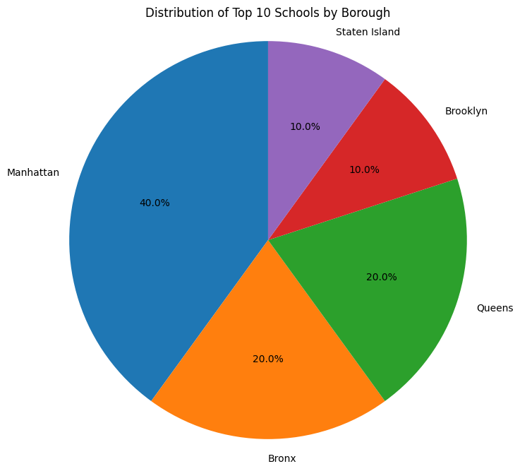
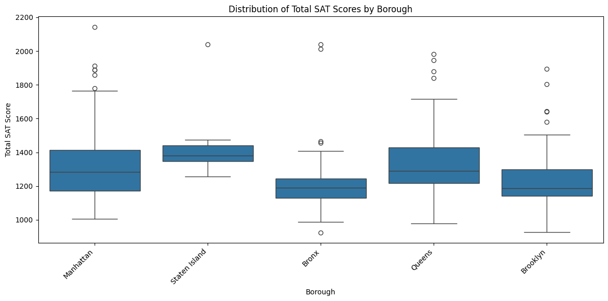

# NYC_Exams_Results_Analysis
Exploring NYC Public Schools Test Result scores

## Table of Contents

- [Context](#project-overview)
- [Project Description](#Project-Description)
- [Dataset](#dataset)
- [Analysis Goals](#analysis-goals)
- [How to Run](#how-to-run)
- [Key Findings](#key-findings)
- [Visualizations](#visualizations)
- [Insights and Conclusions](#insights-and-conclusions)
- [Contributing](#contributing)
- [License](#license)

## Context
Every year, American high school students take the SAT, an exam that measures
- Literacy: reading section
- Numeracy: math section
- Writing: writing section

**Each has a maximum score of 800**

These tests are very important because the results define the admission process. This analysis could provide valuable information. For example, parents could use it to have more information about school performance. 

## Project Description
This project was taken from an online learning platform called DataCamp. The main objective is to demonstrate basic Python skills, focusing on data analysis with the pandas library. Guiding questions are raised:

1. Which NYC schools have the best math results?
2. What are the top 10 performing schools based on the combined SAT scores?
3. Which borough has the largest standard deviation in the combined SAT score?

## Data Origin and structure
The data was provided by DataCamp. It´s a CSV file, with tabular structure. 

- Source: https://app.datacamp.com/learn/projects/exploring_nyc_public_school_test_result_scores/guided/Python
- Format: CSV
 
 **_*Data Dictionary*_**

| Column Name                     | Data Type | Description                         |
|---------------------------------|-----------|-------------------------------------|
| school_name                     | string    | Name of the school                  |
| borough                         | string    | district or administrative unit     |
| builiding_code                  | sting     | building identifier                 |
| average_math                    | integer   | Average math score (0-800)          |
| average_reading                 | integer   | Average reading score (0-800)       |
| average_writing                 | integer   | Average writing score (0-800)       |
| percent_tested                  | float     | percentage of students tested       |

## Analysis objetives
Obtain insights about NYC public school SAT performance. There are three basic questions. The first is about which schools have the best math results. This same question could be asked for reading and writing. The second is which are the top 10 schools by total SAT score. The third is about which borough shows the greatest variability in results.

## How to Run

You can run this project online—no local installation needed!

### Option 1: Google Colab

[Open the main notebook in Colab]([link-to-your-colab-notebook](https://colab.research.google.com/drive/1As0JpY-maSEBjTGhdffkB84R1IXJh0vZ#scrollTo=347a7856))

### Option 2: GitHub Codespaces/Jupyter

- Clone this repo
- Open `notebooks/analysis.ipynb` in Jupyter/Codespaces

### Dependencies

- Python >= 3.8
- pandas
- matplotlib/seaborn

You can install dependencies locally via:
```bash
pip install -r requirements.txt
```

## Example Usage

```python
import pandas as pd

df = pd.read_csv('data/nyc_schools_sat.csv')
top_math = df.nlargest(10, 'average_math')[['school_name', 'average_math']]
print(top_math)

No need to install anything locally—just click and run!

## Key Findings

- Based on the analysis performed, the borough with the largest standard deviation in total SAT scores is Manhattan. The standard deviation for Manhattan is 230.29. This borough has 89 schools included in the dataset.
  
- Based on the analysis, the top 10 schools by total SAT score are:

1. Stuyvesant High School (Total SAT: 2144)
2. Bronx High School of Science (Total SAT: 2041)
3. Staten Island Technical High School (Total SAT: 2041)
4. High School of American Studies at Lehman College (Total SAT: 2013)
5. Townsend Harris High School (Total SAT: 1981)
6. Queens High School for the Sciences at York College (Total SAT: 1947)
7. Bard High School Early College (Total SAT: 1914)
8. Brooklyn Technical High School (Total SAT: 1896)
9. Eleanor Roosevelt High School (Total SAT: 1889)
10. High School for Mathematics, Science, and Engineering at City College (Total SAT: 1889)

    These are the schools with the highest combined scores from the math, reading, and writing sections of the SAT.
 
- Based on the output from top_10_count_borough (series that shows how many of the top 10 schools by total SAT score are located in each borough

  According to this analysis, the distribution of the top 10 schools across boroughs is:

  Manhattan: 4 schools
  Bronx: 2 schools
  Queens: 2 schools
  Brooklyn: 1 school
  Staten Island: 1 school

  

  *Figure: Distribution of Top 10 Schools by Borough.*
  
This indicates that Manhattan has the highest number of schools represented in the top 10 list based on total SAT scores in the dataset.

## Insights and conclusions
First, we could determine with the top 10 schools which are the schools with the best SAT scores. Names like Stuyvesant High School or Bronx High School of Science stand out. Another conclusion we could draw from this analysis is that the schools with top scores are not evenly distributed across the city. Manhattan has 40% of the top 10, followed by Bronx with 20%. On the other hand, Brooklyn, Queens, and Staten Island have fewer top-performing schools. Finally, the standard deviation analysis (largest_std_dev) shows that Manhattan not only has the highest number of schools in the top 10, but also the greatest variability in SAT scores among all schools in the borough.



*Figure: box plot of the total SAT results by borough.*

